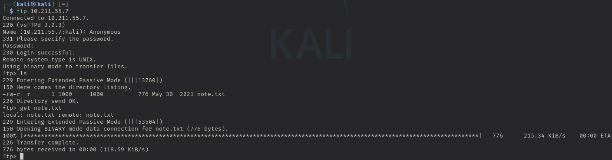
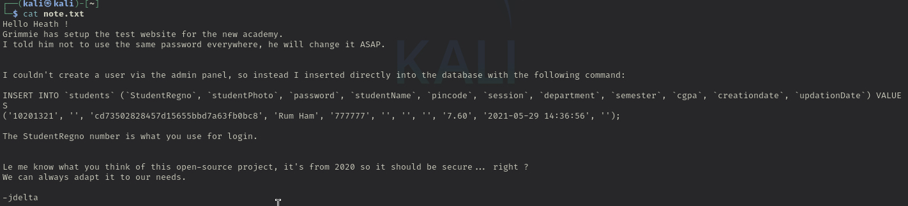
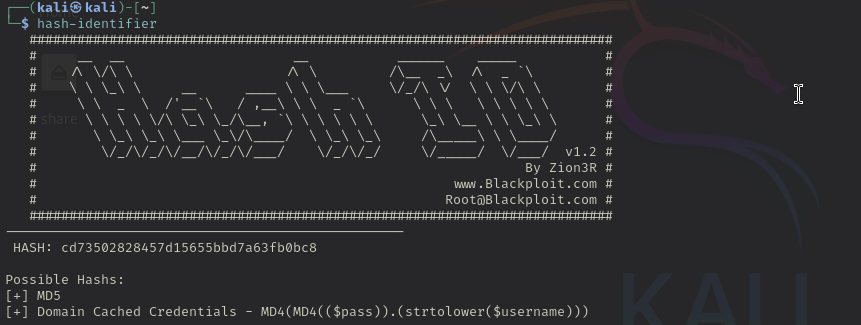
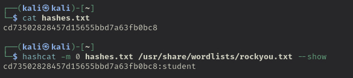

```
Alias: Academy
Date: 3/31/2025
Platform: Linux/Debian
Category:
Difficulty: Easy
Tags:
Status:
Creds: root/tcm
IP: 10.211.55.7/24, 10.211.55.8/24
```

# Resolution Summary
- This is a technical walkthrough of the Academy machine from (HTB). This is a great box to practice scanning and enumeration techniques, reverse shell, and privilege escalation all wrapped into a CTF format.
# Tools Used
- dirbuster
- ffuf
- nmap
- ftp
- hashcat
- php-reverse-shell
- linPEAS
- hash-identifier
- pspy
# Information Gathering

Scanned all TCP ports:

```
21, 22, 80
```

Enumerated open TCP ports:

```
21, 22, 80
```

Enumerated top 200 UDP ports:

```
N/A
```
---
# Enumeration
## Port 22 - SSH
SSH could be used here for brute forcing and testing for weak credentials. However, since this is a CTF environment, I'll make note that this port is open.
## Port 80 - HTTP (Apache)

Apache2 Debian Default Page is shown by navigating to 10.211.55.7/10.211.55.8. A finding that could indicate poor hygiene. Utilizing two tools for identifying directories(ffuf & dirbuster), I've identified the following directories:
```
10.211.55.7/academy
10.211.55.7/phpmyadmin

commands used:
	ffuf: ffuf -w /usr/share/wordlists/dirbuster/directory-list-2.3-medium.txt:FUZZ -u http://10.211.55.7/FUZZ
	dirbuster: dirb http://10.211.55.7
```
 Academy could be a good point of entry. Logging in using credentials that were found in the "note.txt" file on the machine, this logged me into a change password page. But navigating around to the my profile page could be fruitful. Standard information to change here, name, GPA, etc. But there is also an option to upload a student photo, an opportunity for a reverse shell.
## Port 21 - FTP (Vsftpd 3.0.3)

Nmap scan shows that anonymous FTP login was allowed, signed in using Anonymous/Anonymous and found a file under the name "note.txt". Opening it has information explaining that the test website for the new academy was created but told "Grimmie" to not use the same password everywhere. User also couldn't create a user via the admin panel, instead inserted directly into the database with the following command with SQL:
```
INSERT INTO `students` (`StudentRegno`, `studentPhoto`, `password`, `studentName`, `pincode`, `session`, `department`, `semester`, `cgpa`, `creationdate`, `updationDate`) VALUES
('10201321', '', 'cd73502828457d15655bbd7a63fb0bc8', 'Rum Ham', '777777', '', '', '', '7.60', '2021-05-29 14:36:56', '');

```

It's also been noted that the "StudentRegno" number is what's use for login, which means that the associated value for this would be "cd73502828457d15655bbd7a63fb0bc8". Seeing that this is a hash, I've used hashcat to identify what the password is. Value of hash equates to "student", which indicates a weak password policy.
# Exploitation

## FTP

It's also been noted that the "StudentRegno" number is what's use for login, which means that the associated value for this would be "cd73502828457d15655bbd7a63fb0bc8". Seeing that this is a hash, I've used hashcat to identify what the password is. Value of hash equates to "student", which indicates a weak password policy. 


Nmap scan shows anonymous login and a note.txt file. Simply choosing username as "Anonymous" logs me right in, entering the "get" command to transfer note.txt to my machine.
 

Inside the file, it says "StudentRegno" is used for login. This is sensitive data. By matching database entries to values from the email, I now have a username—`10201321`—and a password that looks like a hash: `cd73502828457d15655bbd7a63fb0bc8`.

## Hash-Identifer / Hashcat
Running Hash-Identifier identifies the string as an MD5 hash. I save the hash into `hashes.txt` and use hashcat to crack it.
 

Time to open 'hashes.txt'. Looks like the credentials are: `10201321/student`.


## HTTP / FFUF
Nmap shows a default webpage if I navigate to the address '10.211.55.7':
![[AcademyApache.jpg]](images/AcademyApache.jpg)

Normally, I would use Gobuster for directory enumeration, but I’ve been experimenting with new tools, so for this machine, I use FFUF (Fuzz Faster U Fool).
![[AcademyFFUF.jpg]](images/AcademyFFUF.jpg)

I could check `http://10.211.55.7/phpmyadmin`, but I start at `http://10.211.55.7/academy`, given that the machine is named “Academy.” Could be a nice foothold.

I land on the `academy` page and log in using the credentials from `note.txt`.

![[AcademyLogin.jpg]](images/AcademyLogin.jpg)

After clicking around, I found a "Profile" tab that allows users to upload their student photos. This could be an interesting vector. The form likely accepts `.jpeg` or `.png` images, but what if I upload something else—like a text file or script? Could I exploit the file upload feature? If so, I could use a reverse shell to gain access. Also, I've noticed this site uses PHP.
![[AcademyReverseShell.jpg]](images/AcademyReverseShell.jpg)

## Reverse Shell
I grabbed a PHP reverse shell from pentestmonkey and configured it with my attack IP and port `7777`. By default, the port shows as '1234' but just to be a bit more conscious of the environment I've chosen a different number. Once the reverse shell is ready, I set up a listener on port `7777` on my attack machine, waiting for the connection.


Next, I visit the Academy site again and upload the PHP shell file.
![[AcademyReverseShell2.jpg]](images/AcademyReverseShell2.jpg)

Got a connection! But since I’m not root yet, I’ll need to escalate my privileges.
![[AcademyLinpeas.jpg]](images/AcademyLinpeas.jpg)

---
# Privilege Escalation

## Privilege Escalation Vector

Target is on Linux OS as noted earlier in the nmap scan, so I will use linPeas to search for any footholds available to perform privilege escalation. I downloaded the script from [https://github.com/peass-ng/PEASS-ng/tree/master/linPEAS](peass-ng) on my attack machine and spun up a server so the target machine can grab that file and execute it.

![[AcademyServer.jpg]](images/AcademyServer.jpg)
![[AcademyWGet.jpg]](images/AcademyWGet.jpg)
![[AcademyWGet2.jpg]](images/AcademyWGet2.jpg)

Running linPeas for a short while has stumbled upon some paths of privilege escalation.
![[AcademyLinpeas3.jpg]](images/AcademyLinpeas3.jpg)
![[AcademyLinpeas4.jpg]](images/AcademyLinpeas4.jpg)

There's a ton of information that was returned from linPeas but these are the most notable. An admin account for 'grimmie' and an password with it. There's also a 'backup.sh' file that could be of use. Let's try logging on.

## SSH

![[AcademySSH3.jpg]](images/AcademySSH3.jpg)
![[AcademySSH.jpg]](images/AcademySSH.jpg)

After logging in as `grimmie`, I've noticed that either sudo has been disabled or it's not functioning properly. Taking a look at the `backup.sh` file, I can deduce that this backs up the Academy. It could be running periodically via some sort of automation. I was unable to identify any cron tasks in linPEAS for this, nor did I find any scheduled jobs when I ran `crontab -l`.

## pspy

`pspy` is a command-line tool that captures processes and activity in real-time, without needing root permissions. I use this to check if the backup process is running.

After downloading `pspy` to my attack machine, I get the target machine to grab it via the same web server I used earlier.

![[AcademySSH2.jpg]](images/AcademySSH2.jpg)
![[AcademyCronJob.jpg]](images/AcademyCronJob.jpg)

It was able to fine the backup running, around every minute or so. Now that I can confirm that it's been running, let's go back to the "grimmie" account to see if I can use this to run a reverse shell.

## Reverse Shell

I've set up a listener port on the attack machine using port 8080. Next, I will change the backup.sh file by deleting the contents and modifying it to a bash reverse shell one liner.

![[AcademySSH.jpg]](images/AcademySSH.jpg)
![[AcademyBashRShell.jpg]](images/AcademyBashRShell.jpg)

Saved the changes, this script is going to run about every minute or so as root, going back to my attack machine.

![[AcademyFlag.jpg]](images/AcademyFlag.jpg)

And there's the flag!

# Trophy & Loot
- user.txt
- root.txt
- "cd73502828457d15655bbd7a63fb0bc8:student"
- 10201321/student
